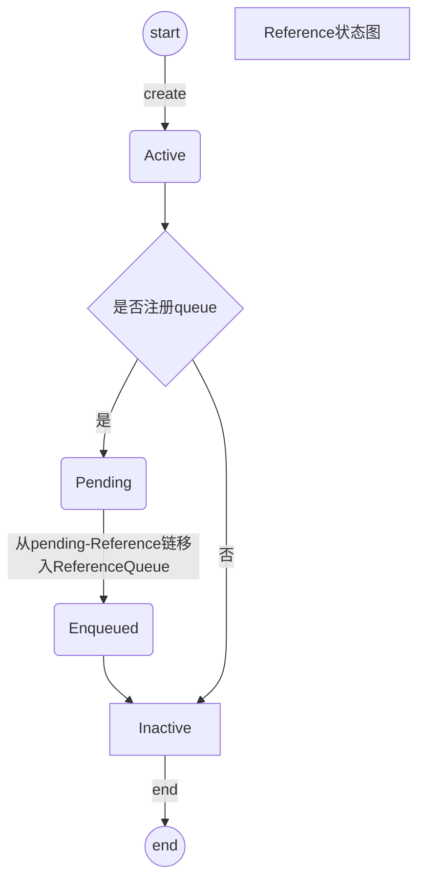

# Java四种引用

UML关系图


## 1、强引用（StrongReference）

```java
Object object = new Object();
```

## 2、软引用（SoftReference）

内存足够时，垃圾回收器不会回收。内存不够，会回收。

```java
SoftReference<Object> softReference = new SoftReference<Object>(new Object());
```

## 3、弱引用（WeakReference）

当发生内存回收时，不管内存是否充分，弱引用都会被回收。

```java
WeakReference<Object> weakReference = new WeakReference<Object>(new Object());
```

ThreadLocal就是使用的WeakReference，防止用户忘记调用remove，发生内存泄漏。

### WeakHashMap深度解析

```java
//private final ReferenceQueue<Object> queue = new ReferenceQueue<>();
//引用队列，在弱引用被回收的时候会把这个对象存放在这里
private void expungeStaleEntries() {
        for (Object x; (x = queue.poll()) != null; ) {
            synchronized (queue) {
                @SuppressWarnings("unchecked")
                    Entry<K,V> e = (Entry<K,V>) x;
                int i = indexFor(e.hash, table.length);

                Entry<K,V> prev = table[i];
                Entry<K,V> p = prev;
                while (p != null) {
                    Entry<K,V> next = p.next;
                    if (p == e) {
                        if (prev == e)
                            table[i] = next;
                        else
                            prev.next = next;
                        // Must not null out e.next;
                        // stale entries may be in use by a HashIterator
                        e.value = null; // Help GC
                        size--;
                        break;
                    }
                    prev = p;
                    p = next;
                }
            }
        }
    }
```

#### 引用队列

SoftReference、WeakReference、PhantomReference 都有一个可以传递 ReferenceQueue 的构造器。

创建引用的时候，可以指定关联的队列，当 GC 释放对象内存的时候，会将引用加入到引用队列。如果程序发现某个虚引用已经被加入到引用队列，那么就可以在所引用的对象的内存被回收之前采取必要的行动，这相当于是一种通知机制。

```java

```

#### Reference

## 4、虚引用（PhantomReference）

也称为“**幽灵引用**”或者“**幻影引用**”

虚引用不会改变对象的生命周期，如果一个对象仅持有虚引用，那么它就和没有任何引用一样。

如果一个对象仅持有虚引用，那么它就和没有任何引用一样，在任何时候都可能被垃圾回收器回收，它不能单独使用也不能通过它访问对象，虚引用必须和引用队列（RefenenceQueue）联合使用。

**设置虚引用的唯一目的，就是在这个对象被回收器回收的时候收到一个系统通知或者后续添加进一步的处理**。

应用场景：主要用于跟踪对象何时被回收，比如防止资源泄漏等；应用场景和finalize类似，但是这是一种比finalizer更轻量更好的机制。

例子：DirectByteBuffer对象在创建的时候关联了一个PhantomReference（Cleaner），在这个子类中调用Unsafe的free接口来释放DirectByteBuffer对应的堆外内存块。

## 5、实现原理

利用类Reference实现。Reference及其子类有两大功能。

- **实现了特定的引用类型**，JVM垃圾回收器硬编码识别`SoftReference`，`WeakReference`，`PhantomReference`等这些具体的类，对其reference变量进行特殊对象处理，才有了不同的引用类型的效果。因而**不能自行扩充引用类型**。
- **用户可以在对象被回收后得到通知**。可以用回调，在对象被回收后，JVM回调。由于时机及实现复杂，舍弃。使用的是把引用对象被回收的Reference添加到一个队列中，用户后续自己从队列中获取并使用。

### 5.1、Reference

Reference对象有四种状态。

1. Active。对象新建时。由垃圾回收器处理，如果可达性分析发生变化则垃圾回收器会切换实例的状态为Pending或Inactive。如果Reference注册了ReferenceQueue，则切换为Pending，并且Reference会加入到pending-Reference链表中，如果没有注册ReferenceQueue，会切换为Inactive。

2. Pending。在pending-Reference链表中的Reference的状态，这些Reference等待被加入到ReferenceQueue中，

3. Enqueued。在ReferenceQueue队列中的Reference的状态，如果Reference从列表中移除，会进入Inactive状态。

4. Inactive。Reference的最终状态，不可改变。



#### 5.1.1、pending-Reference链表

当reference引用的对象被回收后，该实例会被添加到ReferenceQueue。并不是由JVM一步操作，而是分两步。降低JVM操作成本。

- JVM把Reference添加到pending-Reference链表中。Reference对象中有一个静态的pending成员变量，它就是这个pending-Reference链表的头结点。而另一个成员变量discovered就是这个链表的指针，指向下一个节点。

- ReferenceHandler将回收的对象从pending-Reference链表中，加入 ReferenceQueue

垃圾回收器把reference添加到pending-Reference链表中。pending是链表的头结点，discovered是链表的指针，指向下一个结点。

#### 5.1.2、ReferenceHandler线程

**在Reference类中启动**

```java
static {
        ThreadGroup tg = Thread.currentThread().getThreadGroup();
        for (ThreadGroup tgn = tg;
             tgn != null;
             tg = tgn, tgn = tg.getParent());
        Thread handler = new ReferenceHandler(tg, "Reference Handler");
        /* If there were a special system-only priority greater than
         * MAX_PRIORITY, it would be used here
         */
        handler.setPriority(Thread.MAX_PRIORITY);
        handler.setDaemon(true);
        handler.start();

        // provide access in SharedSecrets
        SharedSecrets.setJavaLangRefAccess(new JavaLangRefAccess() {
            @Override
            public boolean tryHandlePendingReference() {
                return tryHandlePending(false);
            }
        });
    }
```

**Reference处理**

```java
static boolean tryHandlePending(boolean waitForNotify) {
        Reference<Object> r;
        Cleaner c;
        try {
            synchronized (lock) {
                //检查pending链表是否为空，从链表中移出头结点
                if (pending != null) {
                    r = pending;
                    // 'instanceof' might throw OutOfMemoryError sometimes
                    // so do this before un-linking 'r' from the 'pending' chain...
                    c = r instanceof Cleaner ? (Cleaner) r : null;
                    // unlink 'r' from 'pending' chain
                    pending = r.discovered;
                    r.discovered = null;
                } else {
                    // The waiting on the lock may cause an OutOfMemoryError
                    // because it may try to allocate exception objects.
                    if (waitForNotify) {
                        lock.wait();
                    }
                    // retry if waited
                    return waitForNotify;
                }
            }
        } catch (OutOfMemoryError x) {
            // Give other threads CPU time so they hopefully drop some live references
            // and GC reclaims some space.
            // Also prevent CPU intensive spinning in case 'r instanceof Cleaner' above
            // persistently throws OOME for some time...
            Thread.yield();
            // retry
            return true;
        } catch (InterruptedException x) {
            // retry
            return true;
        }

        // Fast path for cleaners
        if (c != null) {
            c.clean();
            return true;
        }
        //队列非空则从链表中移入queue
        ReferenceQueue<? super Object> q = r.queue;
        if (q != ReferenceQueue.NULL) q.enqueue(r);
        return true;
    }
```

#### 5.1.3、ReferenceQueue

 内部存储的是一个queue的链表，是Reference自身，存储的head指向当前最新的结点。

```java
 boolean enqueue(Reference<? extends T> r) { /* Called only by Reference class */
        synchronized (lock) {
            // Check that since getting the lock this reference hasn't already been
            // enqueued (and even then removed)
            ReferenceQueue<?> queue = r.queue;
            if ((queue == NULL) || (queue == ENQUEUED)) {
                return false;
            }
            assert queue == this;
            r.queue = ENQUEUED;
            r.next = (head == null) ? r : head;
            head = r;
            queueLength++;
            if (r instanceof FinalReference) {
                sun.misc.VM.addFinalRefCount(1);
            }
            lock.notifyAll();
            return true;
        }
    }
```


# 引用与GC

| 引用类型 | GC回收时机  | 生存时间        |
| ---- | ------- | ----------- |
| 强引用  | Never   | 一致存活直到JVM停止 |
| 软引用  | MajorGC | 内存不足时终止     |
| 弱引用  | MinorGC | GC后终止       |
| 虚引用  | unknown | unknown     |

而在处理和回收引用时，通常需要两次GC才能完成，在第一次GC时把引用加入到 queue队列（引用队列）。第二次GC的时候才会真正回收该对象。

# 引用引起GC问题

参数-XX:+PrintReferenceGC。来定位是哪种引用时间处理太长。

若代码层面无法解决，-XX:+ParallelRefProcEnabled 参数加快引用处理。
