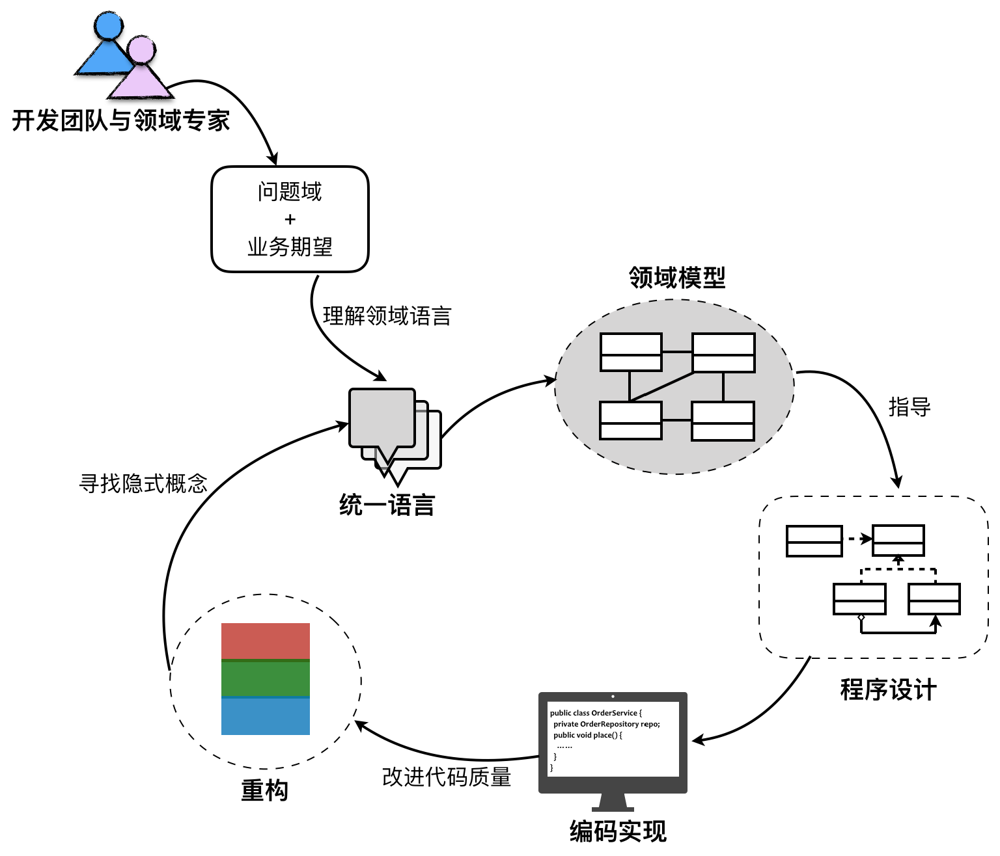
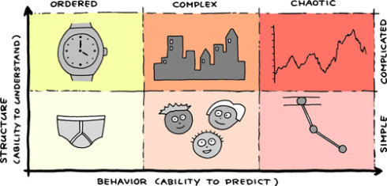

>领域驱动设计是一个开放的设计方法体系。
>
# 软件复杂度
## 领域驱动设计过程

### 战略设计
- 问题域方面：针对问题域，引入限界上下文（Bounded Context）和上下文映射（Context Map）对问题域进行合理的分解，识别出核心领域（Core Domain）与子领域（SubDomain），并确定领域的边界以及它们之间的关系，维持模型的完整性。
- 架构方面：
  - 通过分层架构来隔离关注点，尤其是将领域实现独立出来，能够更利于领域模型的单一性与稳定性；
  - 引入六边形架构可以清晰地表达领域与技术基础设施的边界；
  - CQRS 模式则分离了查询场景和命令场景，针对不同场景选择使用同步或异步操作，来提高架构的低延迟性与高并发能力。
### 战术设计
- 值对象（Value Object） 
- 实体（Entity） 
- 领域服务（Domain Service） 
- 领域事件（Domain Event） 
- 资源库（Repository） ：负责从存放资源的位置（数据库、内存或者其他 Web 资源）获取、添加、删除或者修改领域对象。
- 工厂（Factory） ：负责领域对象的创建，往往用于封装复杂或者可能变化的创建逻辑
- 聚合（Aggregate）：是一种边界，它可以封装一到多个实体与值对象，并维持该边界范围之内的业务完整性。
- 应用服务（Application Service）

### 演进的领域设计过程

## 软件复杂度的成因
Jurgen Appelo 从理解力与预测能力两个维度分析了复杂系统理论。

### 理解力
#### 规模
当需求增多时，软件系统的规模也会增大，且这种增长趋势并非线性增长，会更加陡峭。倘若需求还产生了事先未曾预料到的变化，我们又没有足够的风险应对措施，在时间紧迫的情况下，难免会对设计做出妥协，头疼医头、脚疼医脚，在系统的各个地方打上补丁，从而欠下技术债（Technical Debt）。
#### 结构
结构之所以变得复杂，在多数情况下还是因为系统的质量属性决定的。例如，我们需要满足高性能、高并发的需求，就需要考虑在系统中引入缓存、并行处理、CDN、异步消息以及支持分区的可伸缩结构。倘若我们需要支持对海量数据的高效分析，就得考虑这些海量数据该如何分布存储，并如何有效地利用各个节点的内存与 CPU 资源执行运算。  
在 Pete Goodliffe 讲述的《两个系统的故事：现代软件神话》中详细地罗列了无序设计系统的几种警告信号：
- 代码没有显而易见的进入系统中的路径； 
- 不存在一致性、不存在风格、也没有统一的概念能够将不同的部分组织在一起； 
- 系统中的控制流让人觉得不舒服，无法预测； 
- 系统中有太多的“坏味道”，整个代码库散发着腐烂的气味儿，是在大热天里散发着刺激气体的一个垃圾堆； 
- 数据很少放在使用它的地方，经常引入额外的巴罗克式缓存层，目的是试图让数据停留在更方便的地方。
### 预测能力
#### 变化
未来总会出现不可预测的变化，这种不可预测性带来的复杂度。   
从需求的角度讲，变化可能来自业务需求，也可能来自质量属性。  
还有一种变化，则是因为我们依赖的第三方库、框架或平台、甚至语言版本的变化带来的连锁反应。
## 控制软件复杂度
### 分而治之，控制规模
分而治之的思想，遵循小即是美的设计美学。
### 保持结构的清晰与一致
所有设计质量高的软件系统都有相同的特征，就是拥有清晰直观且易于理解的结构。   
整洁架构的目的在于识别整个架构不同视角以及不同抽象层次的关注点，并为这些关注点划分不同层次的边界，从而使得整个架构变得更为清晰，以减少不必要的耦合。要做到这一点，则需要合理地进行职责分配，良好的封装与抽象，并在约束的指导下为架构建立一致的风格，这是许多良好系统的设计特征。
### 拥抱变化
- 可进化性（Evolvability） :划分设计单元的边界，以确定每个设计单元应该履行的职责以及需要与其他设计单元协作的接口
- 可扩展性（Extensibility） :封装，通过隐藏细节、引入间接等方式来隔离变化、降低耦合
- 可定制性（Customizability）:在 SaaS 风格的系统架构中，我们常常通过引入元数据（Metadata）来支持系统的可定制。插件模式也是满足可定制性的常见做法，它通过提供统一的插件接口，使得用户可以在系统之外按照指定接口编写插件来扩展定制化的功能。
# 领域知识
# 限界上下文
# 架构与代码模型
# EAS 系统的战略设计实践
